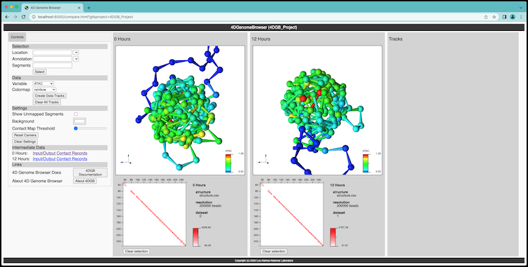

Getting Started
===============

   The 4dgbworkflow is a workflow that takes user input data
   and manages a 4D Genome Browser instance for that data.

The 4D Genome Browser is a tool for querying, visualization and
annotating genome data.

* `The 4DGB repository <https://github.com/lanl/4Dgb>`_

