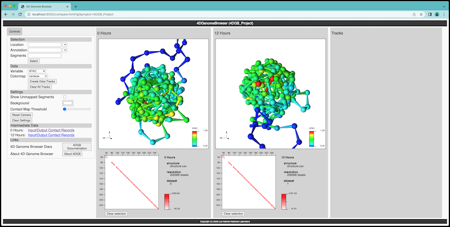

Example: starting with a template 
=================================

   Screen capture of the 4D Genome Browser running on the template
   project created by the tool. The template project can be copied
   and edited by a user to easily create a custom version of the
   workflow.

To get started, you can create a template project with the following command:

.. code-block:: console

   $ 4dgbworkflow template

This will create a template project directory, called ``4DGB_Project``. Listing
the directory shows the files that have been created:

.. code-block:: console

   workingdir/
        4DGB_Project/
            ENCLB571GEP.chr22.200kb.h5.hic
            ENCLB870JCZ.chr22.200kb.12.h5.hic
            chr22.tracks.12.csv
            chr22.tracks.csv
            project.yaml

This template project can be used as an example of the tool working, and also 
as a template for creating your own projects. To run the tool on the example 
project, type this command:

.. code-block:: console

   $ 4dgbworkflow run 4DGB_Project

The workflow will run, using the data in the project directory. The first part
of the workflow computes a 3D structure for each input data structure, and this
may take some time, depending upon the resolution of the input data, and the
complexity of that data.

.. code-block:: 

   $ 4dgbwqorkflow run 4DGB_Project
   > Workflow version: v0.4.5
   > Browser version: v1.4.3
   [>]: Building project... (this may take a while)
     [! ENCLB571GEP.chr22.200kb.h5.hic]: Processing Hi-C file...
     [! ENCLB870JCZ.chr22.200kb.12.h5.hic]: Processing Hi-C file...

When the workflow finishes, it will print information to the shell about
how to connect to the 4D Genome Browser server:

.. code-block:: console

   $ 4dgbwqorkflow run 4DGB_Project
   > Workflow version: v0.4.5
   > Browser version: v1.4.3
   [>]: Building project... (this may take a while)
     [! ENCLB571GEP.chr22.200kb.h5.hic]: Processing Hi-C file...
     [! ENCLB870JCZ.chr22.200kb.12.h5.hic]: Processing Hi-C file...

        #
        # Ready!
        # Open your web browser and visit:
        # http://localhost:8000/compare.html?gtkproject=4DGB_Project
        #
        # Press [Ctrl-C] to exit
        #

Paste the URL into a browser, and you will see the final tool running (see figure at the top of this page).

