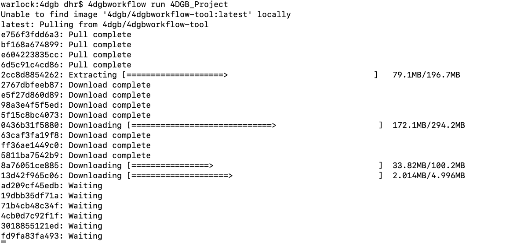

Installing the 4dgbworkflow tool
================================

The workflow tool is a python script, and is installed using pip:

.. code-block:: console

   $ pip install 4dgb-workflow

This will install a python module, and the ``4dgbworkflow`` script. This is the 
command that you will use when invoking the workflow in a shell. The help for the 
tool shows options and subcommands:

.. code-block:: console

   $ 4dgbworkflow --help

   usage: 4DGBWorkflow [-h] [-n] [--docker PATH] [--container CONTAINER] [-t TAG]
                       {run,update,template,version} ...

   Script to run docker containers for the 4DGB Workflow

   positional arguments:
       {run,update,template,version}
                           Command
       run                 Run the workflow
       update              Update the Docker image for the Workflow
       template            Create a template directory with example data
       version             Get version information from Docker container

   optional arguments:
     -h, --help            show this help message and exit
     -n, --dry-run         Show what docker commands would be run, but don't run
                           them
     --docker PATH         Override the path/name of the docker client executable
     --container CONTAINER
     -t TAG, --tag TAG     Version tag for the container to use. (Default:
                           'latest')

After you have the tool installed, it will download the Docker image it needs from
``hub.docker.com``. Thus, the first time you run the tool, you will see the download
happening in the shell. This is how that looks in the shell:

Once the docker image is updated, the command will continue.
