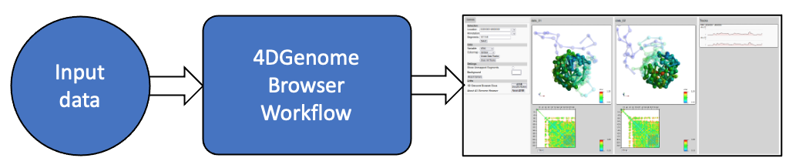

Getting Started
===============

   The 4dgbworkflow is a workflow that takes user input data
   and creates a 4D dataset and a 4D Genome Browser for that data. 

The 4DGB workflow is a python script that manages a complex workflow of steps
that take a user's input data and transforms that data into an interactive
visualization of 4D genomic data.

The tool's set of operations is packaged in a Docker executable, which means
the tools can be run on all operating systems, as long as Docker is present. 

To get started, both ``python`` and ``Docker`` must be installed.

* `Docker instructions <https://docs.docker.com/desktop/>`_ 
*  python v3.x can be installed in many ways, and is likely already 
   part of your system's software.

